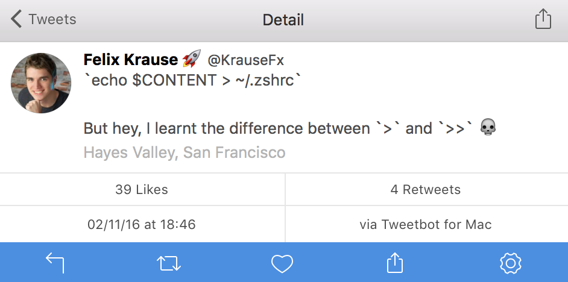

# What dotfiles is Felix using

This repo contains one (maybe more in the future) dotfiles.

After I sent of this tweet I decided to move my dotfiles to GitHub. I'm still only using a very basic set of things, however I'm really happy about how much time [my aliases](https://github.com/KrauseFx/dotfiles/blob/master/.zshrc#L10) has saved me so far.

---

For more information about the terminal I'm using, check out [KrauseFx/what-terminal-is-felix-using](https://github.com/KrauseFx/what-terminal-is-felix-using) 🚀

----

To clone the repo, do the following

1. `cd`
1. `git clone https://github.com/KrauseFx/dotfiles .dotfiles`
1. `ln -s ~/.dotfiles/.zshrc ~/.zshrc`
